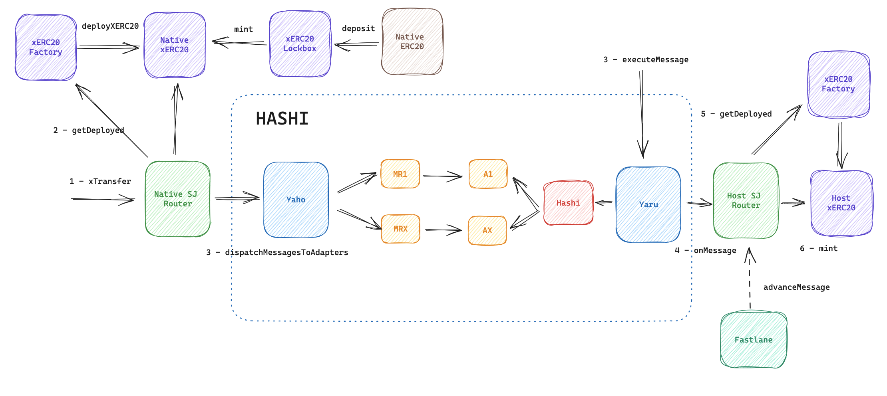

# Safe Junction with xERC20

## Safe Junction with xERC20&#x20;

<figure><figcaption>
Safe Junction with xERC20
</figcaption></figure>

#### How it works

1. **Deploy xERC20 Contracts**: Start by deploying xERC20 contracts as outlined in the [xERC20 documentation](https://docs.connext.network/usecases/xerc20).
2. **Obtain xERC20 Token**: For a specific token, acquire the corresponding xERC20 token on the native chain by locking the native token in the xERC20 Lockbox.
3. **Use SJRouter for Cross-Chain Actions**: Leverage SJRouter contracts and their `xTransfer` function for cross-chain minting/burning. This function burns the chosen amount of tokens and uses Hashi to send a cross-chain message containing all necessary parameters for calculating the xERC20 token address on the destination chain.
4. **Message Dispatch Through Hashi**: Hashi dispatches the message to all the selected adapters.
5. **Message Processing by Bridges**: Each bridge involved processes the message and stores the message hash in their respective adapters.
6. **Execution of Hashi Message**: After all bridges have processed the message, Hashi executes the message.
7. **Final Minting Process**: Once the message is executed, the host SJRouter trustlessly calculates the xERC20 token address and proceeds to mint the designated quantity of xERC20 tokens. Additionally, there's a provision where a Market Maker might offer an advance on the tokens to the user, for a fee. This service is particularly useful for users who prefer immediate token access, bypassing the waiting period required for all bridges to process the message.

#### Reference

1. [crosschain-alliance/sj-core-contracts](https://github.com/crosschain-alliance/sj-core-contracts?tab=readme-ov-file)
